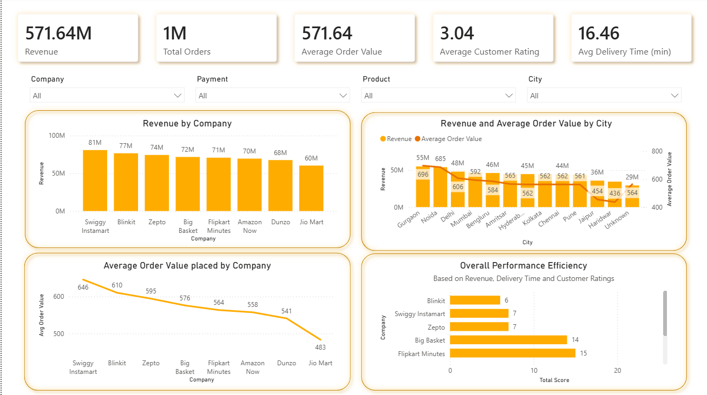
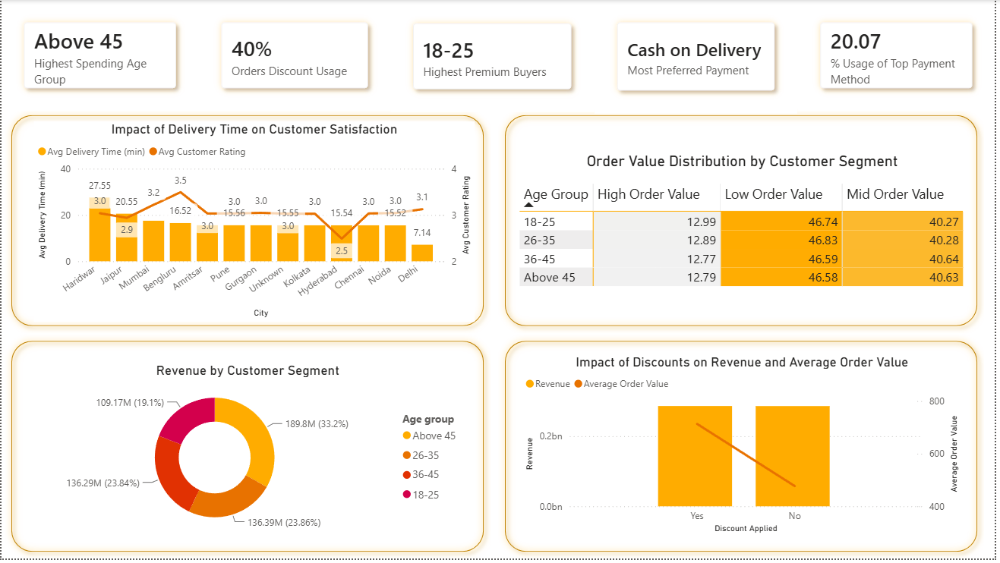
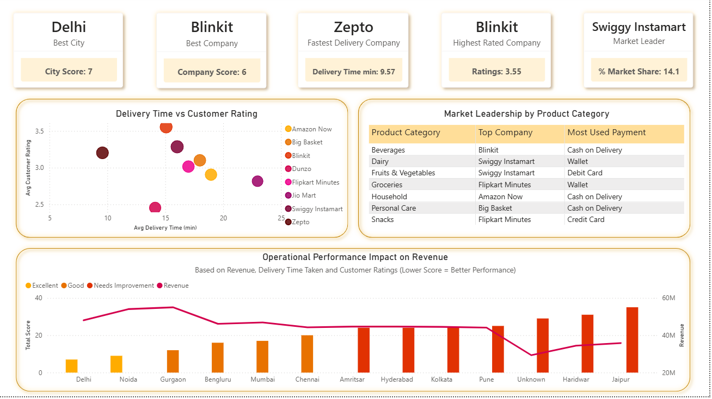

# Quick Commerce Analytics Dashboard | SQL + Power BI


---

# Project Overview

Quick commerce companies process thousands of orders every day across different cities, product categories, and delivery partners. With such a large volume of transactions, making data-driven decisions becomes essential.

This project presents an end-to-end Business Intelligence solution built using MySQL and Power BI to analyze nearly 1 million quick commerce transactions. The project focuses on solving practical business problems through data cleaning, advanced SQL analysis, interactive dashboard development rather than just creating visualizations.

---

# Business Problem

The major business questions to be answered are:

- Which cities generate the highest revenue?
- Which companies dominate different markets?
- Which product categories contribute the most towards overall sales?
- Which customer segments place premium orders?
- Which payment methods are preferred across different product categories?
- Which cities require operational improvements?
- How efficiently is revenue being generated across different cities?

The main objective is to improve:

- Profitability
- Customer Satisfaction
- Delivery Efficiency
- Business Decision Making

---

# Dataset

The dataset consists of approximately 1,000,000 Quick Commerce orders consisting of information regarding customers, companies, deliveries, payments, products and cities.

### Attributes

- Order ID
- Company
- City
- Customer Age
- Order Value
- Delivery Time
- Distance
- Items Count
- Product Category
- Payment Method
- Customer Rating
- Discount Applied
- Delivery Partner Rating

---

# Project Workflow

```
Raw CSV Dataset
        ↓       
Data Cleaning (MySQL)
        ↓
Exploratory Data Analysis (SQL)
        ↓
Advanced SQL Analysis
(Window Functions, CTEs, Views)
        ↓
Power BI Dashboard
        ↓
Business Insights & Recommendations
```

---

# Data Cleaning 

The dataset was cleaned before analysis to improve data quality.

The cleaning process included:

- Removing invalid records
- Handling NULL values
- Standardizing categorical values
- Replacing missing Product Categories with "Others"
- Replacing missing Payment Methods with "Others"
- Converting invalid customer ratings into NULL values
- Validating delivery time and distance values
- Creating customer age groups
- Creating order value segments 

---

# SQL Concepts Used

Some of the SQL concepts implemented in this project include:

- Aggregate Functions
- GROUP BY
- HAVING
- CASE WHEN statements
- Common Table Expressions (CTEs)
- Window Functions
- RANK()
- DENSE_RANK()
- ROW_NUMBER()
- Views
- Stored Procedures
- Subqueries

---

# Business Analysis Performed

The analysis answers several business questions, including:

- Revenue generated by each company.
- Revenue contribution by product category.
- Revenue contribution by city.
- Top-performing company in each city.
- Most preferred payment method by product category.
- Customer age group segmentation.
- Premium customer identification.
- Product category contribution analysis.
- Delivery performance across cities.
- Company market share within each city.
- City performance score.

---

# Power BI Dashboard

The dashboard has been divided into three interactive pages for effective storytelling.

## Executive Summary

A summary of the overall business performance using key KPIs like

- Total Revenue
- Total Orders
- Average Order Value
- Customer Rating
- Delivery Time

---

## Customer & Product Analysis

Provides insights into:

- Customer Segmentation
- Product Categories
- Payment Behaviour
- Premium Customer Groups
- Revenue Contribution

---

## Operations Dashboard

Focuses on operational performance by analyzing:

- Delivery Efficiency
- Revenue by City
- Market Share
- City Performance

---

# Key Business Insights

The analysis uncovered several business insights that can support strategic decision-making:

- Gurgaon emerged as the highest revenue-generating city, highlighting it as a key market for business growth.
- Market leadership varied across cities, with different companies dominating different regions instead of one company leading nationwide. Example- Zepto gives fastest delivery with 9.57 min average delivery time, Blinkit has highest customer ratings (3.55) while Swiggy Instamart dominates in market share at 14.1%.
- Product categories contributed differently to overall revenue, helping identify high-performing categories for inventory prioritization.
- While older age groups (Above 45) spend more money in total across many smaller orders, the 18-25 age group places the highest percentage of individual high-value, premium orders.
- Cash on Delivery were the preferred mode of payment across most product categories, suggesting that customers still value the peace of mind of seeing their order arrive safely before paying.
- A city-wise composite performance score was calculated by combining revenue, customer ratings, and delivery performance. This allows us to see which cities are actually operating efficiently, rather than just which cities are the biggest.

---

# Business Recommendations

Based on the analysis, the following recommendations can help improve business performance:

- Investigate courier networks to Jiomart: The operations dashboard shows Jiomart has the worst efficiency score (23 points) due to high delivery times. The company should study Zepto’s
9.57-minute framework and move more delivery partners into Jiomart's underperforming hubs to fix their delivery lag also keeping in mind that investing too much in logistics in order to get better customer ratings does not provide optimum ROI.
- Implement basket-value thresholds for JioMart: Since JioMart suffers from the lowest Average Order Value ($483) compared to Swiggy Instamart ($646), they shouldn't just run mass marketing. Instead, they should introduce app features like "Free delivery on orders above $600" and "Buy3 get 30% off to encourage users to add more items to their carts before checking out.
- Fix the margin leak on discounts: The discount analysis proved that applying coupons dropped the average order value significantly but did not increase total revenue. The business should stop offering flat discounts and only offer coupons to the lower-spending age brackets (like 26-35) who need incentives to buy.
- Create a premium portal for the 18-25 demographic: Since the 18-25 age group places the highest percentage of individual premium orders, the marketing team should focus on launching high-end, curated product bundles (like gourmet snacks or electronics) directly targeted at them on the app's home screen.
- Introduce localized marketing in Gurgaon: Since Gurgaon is the absolute highest revenue-generating city in the dataset, it has proven product-market fit. A larger percentage of the budget for expansion should be funneled into Gurgaon to maximize returns rather than spreading capital equally across low-performing cities like Jaipur or Haridwar.

---

# Repository Structure

```
Quick-Commerce-Analytics/
│
├── dataset/
├── sql/
├── powerbi/
├── screenshots/
├── documentation/
└── README.md
```

---

# Skills Demonstrated

This project demonstrates practical skills in:

- Data Cleaning
- Data Transformation
- Exploratory Data Analysis
- Business Intelligence
- Dashboard Development
- Data Storytelling
- SQL Programming
- Data Visualization
- Business Analytics

---

# Future Improvements

Some improvements I would like to add in the future are:

- Advanced Feature Engineering
- Python-based ETL pipeline
- Automated data refresh
- Demand forecasting
- Customer segmentation using Machine Learning
- Cloud database integration

---

# 📷 Dashboard Preview

### Executive Dashboard



### Customer Dashboard



### Operations Dashboard



---